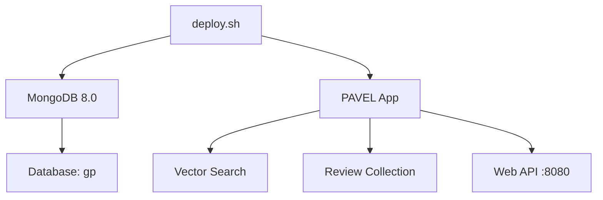

# PAVEL Deployment Guide

## 🚀 One-Click Deployment

PAVEL поддерживает супер простое развертывание в 1 клик с помощью Docker.

### Требования
- Docker Desktop или Docker Engine + Docker Compose
- 4GB+ RAM (для embedding модели)
- 2GB+ свободного места

### Быстрый старт

```bash
# Клонируй репозиторий
git clone <repository-url>
cd pavel

# Запусти одним скриптом!
./deploy.sh
```

Всё! Система развернута и готова к работе.

## 📊 Что развертывается



### Сервисы
- **MongoDB 8.0**: База данных с коллекциями и индексами
- **PAVEL App**: Основное приложение с векторным поиском
- **Networking**: Изолированная Docker сеть
- **Volumes**: Персистентное хранение данных

## 🎛️ Управление

### Основные команды
```bash
# Развернуть (по умолчанию)
./deploy.sh

# Остановить все сервисы
./deploy.sh stop

# Перезапустить
./deploy.sh restart

# Показать статус
./deploy.sh status

# Посмотреть логи
./deploy.sh logs
```

### Использование после развертывания
```bash
# Поиск по отзывам
docker exec pavel-app python search_reviews.py "excellent game" --limit 5

# Сбор новых отзывов
docker exec pavel-app python collect_reviews.py --app-id com.example.app

# Статистика коллекции
docker exec pavel-app python search_reviews.py --stats

# Поиск технических проблем
docker exec pavel-app python search_reviews.py --issues --limit 10

# Анализ настроения
docker exec pavel-app python search_reviews.py --sentiment negative --limit 5
```

## 🔧 Конфигурация

### Переменные окружения (.env)
```env
# Database
MONGO_PASSWORD=pavel123

# Application
PAVEL_DEFAULT_APP_ID=com.nianticlabs.pokemongo
PAVEL_LOG_LEVEL=INFO
PAVEL_EMBEDDING_MODEL=intfloat/multilingual-e5-large

# Features
PAVEL_ENABLE_DEDUPLICATION=true
PAVEL_ENABLE_COMPLAINT_FILTER=true
PAVEL_ENABLE_AUTO_CLUSTERING=true
```

### Порты
- `27017`: MongoDB
- `8080`: PAVEL API (будущее веб-интерфейс)

## 📁 Структура данных

```
pavel/
├── logs/           # Логи приложения
├── models/         # Кэш ML моделей
├── data/           # Временные данные
├── secrets/        # Ключи API
└── volumes/
    └── mongodb/    # База данных MongoDB
```

## 🛠️ Разработка

### Доступ к контейнеру
```bash
# Bash в PAVEL приложении
docker exec -it pavel-app bash

# Bash в MongoDB
docker exec -it pavel-mongodb mongosh
```

### Кастомные команды
```bash
# Запустить с кастомными параметрами
docker-compose up -d
docker exec pavel-app python your_script.py

# Добавить новый модуль
docker exec pavel-app pip install new-package
```

## 🔍 Мониторинг

### Проверка здоровья
```bash
# Статус всех сервисов
./deploy.sh status

# Логи в реальном времени
./deploy.sh logs

# Проверка MongoDB
docker exec pavel-mongodb mongosh --eval "db.adminCommand('ping')"

# Проверка PAVEL
docker exec pavel-app python -c "from src.pavel.core.config import get_config; print('✅ PAVEL OK')"
```

### Метрики
- Использование памяти: `docker stats`
- Размер базы данных: `docker exec pavel-mongodb du -sh /data/db`
- Логи приложения: `./logs/pavel.log`

## 🚨 Troubleshooting

### Частые проблемы

**Docker daemon не запущен**
```bash
# macOS/Windows
# Запустить Docker Desktop

# Linux
sudo systemctl start docker
```

**Недостаточно памяти**
```bash
# Проверить использование
docker stats

# Увеличить memory limit в Docker Desktop
# Settings → Resources → Memory → 6GB+
```

**MongoDB не подключается**
```bash
# Проверить логи
docker logs pavel-mongodb

# Пересоздать контейнер
docker-compose down -v
./deploy.sh
```

**PAVEL приложение не отвечает**
```bash
# Проверить логи
docker logs pavel-app

# Перезапустить
docker-compose restart pavel
```

## 🌍 Production Deployment

Для production используйте:

### Docker Swarm
```bash
# Инициализация swarm
docker swarm init

# Развертывание как stack
docker stack deploy -c docker-compose.yml pavel
```

### Kubernetes (будущее)
- Создать Kubernetes манифесты
- Использовать Helm charts
- Настроить мониторинг с Prometheus

### Cloud Platforms
- **AWS**: ECS + RDS
- **GCP**: Cloud Run + Cloud SQL
- **Azure**: Container Instances + Cosmos DB

## 📈 Масштабирование

### Горизонтальное
- Запустить несколько PAVEL инстансов
- Load balancer (nginx/traefik)
- Shared MongoDB кластер

### Вертикальное  
- Увеличить CPU/RAM для контейнеров
- SSD для MongoDB
- GPU для embedding моделей

---

## ⚡ Быстрая справка

```bash
# 🚀 Развернуть всё
./deploy.sh

# 🔍 Найти баги
docker exec pavel-app python search_reviews.py --issues

# 📊 Посмотреть статистику
docker exec pavel-app python search_reviews.py --stats

# 🛑 Остановить всё
./deploy.sh stop
```

**Готово! PAVEL развернут и работает! 🎉**