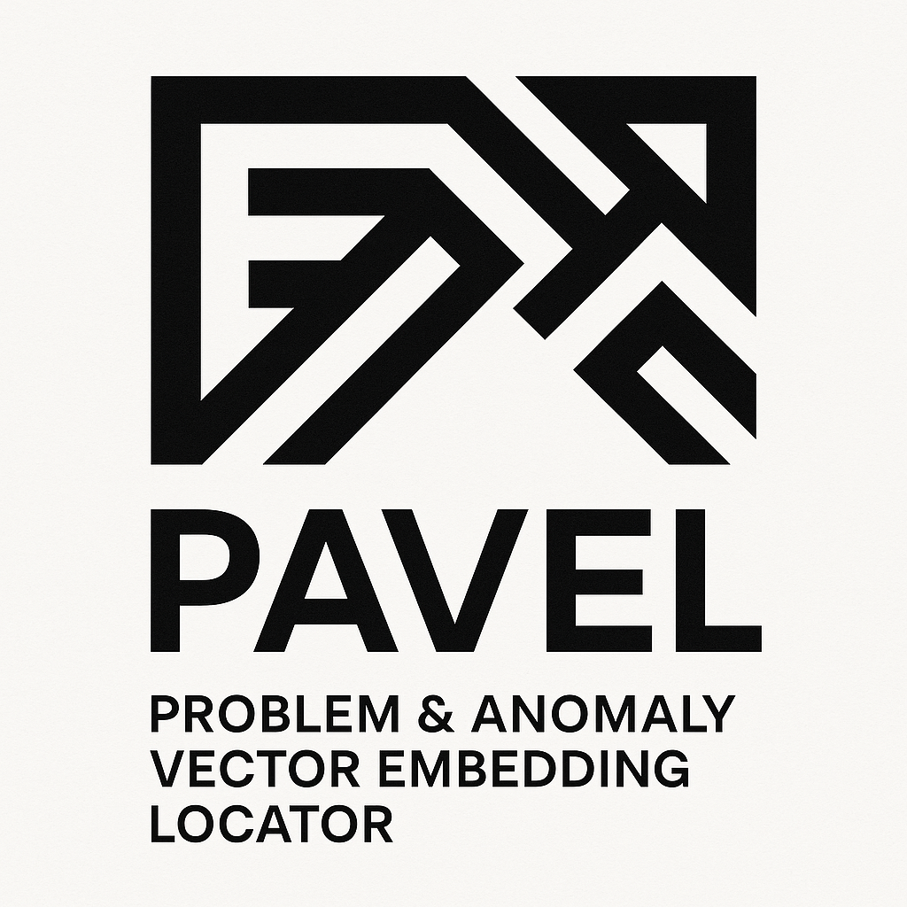

<div align="center">
  
  
  # PAVEL — Problem & Anomaly Vector Embedding Locator

  > **Zero bugs in prod.**
</div>

## Project Structure

```
pavel/
├── 📁 src/pavel/           # Core Python package ✅
│   ├── core/               # Config, logging, utilities
│   ├── ingestion/          # Stage 2: Data ingestion (Google Play API)
│   ├── preprocessing/      # Stage 3: Text normalization & LID
│   ├── embeddings/         # Stage 4: Multilingual embeddings
│   ├── clustering/         # Stage 5+: Smart anomaly detection
│   ├── classification/     # Stage 4: Complaint/non-complaint classifier
│   ├── search/             # Vector search & matching
│   └── reporting/          # Bug reports & analytics
│
├── 📁 applications/        # CLI and other applications ✅
│   └── cli/                # Command-line interface
│
├── 📁 tests/               # Comprehensive testing suite ✅
│   ├── unit/               # Unit tests by component
│   │   ├── core/
│   │   ├── ingestion/
│   │   ├── preprocessing/
│   │   ├── embeddings/
│   │   └── clustering/
│   └── integration/        # Integration tests
│
├── 📁 deployment/          # Docker & infrastructure configs ✅
│   └── docker/
│
├── 📁 tools/               # Utilities & analysis scripts ✅
│
├── pyproject.toml          # Modern Python packaging ✅
├── .env                    # Environment configuration ✅
├── CURRENT_DATA_SCHEMA.md  # Current system architecture ✅
└── README.md              # This file
```

## Data Flow (current implementation)

```
📱 Google Play Reviews (8 languages)
  ↓ Stage 2: Ingestion ✅
🔍 GooglePlayIngester + RateLimiter → MongoDB
  ↓ Stage 3: Preprocessing ✅  
🧹 Normalize + LID + SentenceSplit + Dedupe
  ↓ Stage 5: Embeddings ✅
🧠 E5-multilingual (384-dim vectors) → VectorStore
  ↓ Stage 5+: Smart Anomaly Detection ✅
🎯 Adaptive Clustering + Week-over-week Analysis
  ↓
📊 Anomaly Reports + Health Scores + Operational vs Product Issues

🚧 TODO: Stage 4 Complaint Filter + Stage 7-14
```

## Goals (what & why)

* Automatically **find and group** complaint‑like issues into bug clusters.
* **Track trends** (two weeks vs two weeks) with stable cluster IDs.
* **Search by free‑text** bug description and return best‑matching cluster(s).
* **Draft bug reports**; return **NOT\_BUG JSON** when evidence is weak.

## Plan (tick as you go)

* [x] Stage 0: Kickoff & access (repo, env, secrets)
* [x] Stage 1: Data model (reviews, clusters)
* [x] Stage 2: Ingestion (history + incremental)
* [x] Stage 3: Preprocessing (normalize, LID, split, dedupe)
* [ ] Stage 4: Complaint detection (rules/model)
* [x] Stage 5: Embeddings (sentence‑level)
* [x] Stage 6: Vector search (filters)
* [x] Stage 5+: Smart anomaly detection (adaptive clustering)
* [ ] Stage 7: Clustering (weekly×version)
* [ ] Stage 8: Cluster labels
* [ ] Stage 9: Tracking & 2W→2W compare
* [ ] Stage 10: Bug‑text search → candidate clusters
* [ ] Stage 11: BUG report / NOT\_BUG JSON
* [ ] Stage 12: Alerts & prioritization
* [ ] Stage 13: Dashboard
* [ ] Stage 14: Ops & quality (SLOs, retention)

## Stage 0 ✅ Complete

**Default app:** `sinet.startup.inDriver`

### Setup
1. Copy `.env.example` to `.env` and configure
2. Install dependencies: `pip install -e .`
3. Run test: `python tests/unit/core/test_stage0.py`

### Test Coverage
- ✅ Configuration with default appId fallback
- ✅ Google Play fetch for single locale
- ✅ Rate limiting awareness
- ✅ Field validation (all fields non-empty)
- ✅ Multiple locale support

### Files Created
- `.env.example` - Environment configuration template
- `src/pavel/core/config.py` - Configuration management with default appId
- `src/pavel/core/logger.py` - JSON structured logging
- `tests/unit/core/test_stage0.py` - Stage 0 verification script
- `pyproject.toml` - Python project configuration

## Stage 1 ✅ Complete

**MongoDB 8 with Vector Search support**

### Schema Design
- **6 Collections**: `reviews`, `clusters`, `app_metadata`, `processing_logs`, `alerts`, `embeddings_cache`
- **All Google Play fields preserved**: 11/11 fields including `replyContent`, `repliedAt`
- **Composite _id**: `appId:reviewId` for global uniqueness
- **Complete data preservation**: `rawData` field stores original scraper response

### Docker Integration
- MongoDB 8 container: `pavel-mongo`
- Volume persistence: `pavel_mongodb_data`
- Admin UI available at http://localhost:8081

### Test Results (8/8 passed)
- ✅ 30 real reviews ingested from 3 locales
- ✅ Duplicate prevention via composite key
- ✅ Query performance <2ms on indexed fields
- ✅ Full field preservation and data integrity
- ✅ Schema validation with proper types

### Setup
```bash
# Start MongoDB 8
docker compose -f deployment/docker/docker-compose.yml up -d

# Run tests
python tests/unit/core/test_stage1.py
```

### Key Features
- **Zero data loss**: All scraper fields saved + PAVEL extensions
- **Optimized indexes**: 11 indexes for fast queries
- **Anti-duplication**: `appId:reviewId` composite key strategy
- **Vector ready**: MongoDB 8 supports `$vectorSearch` for Stage 6

## Stage 2 ✅ Complete

**Data ingestion from Google Play Store**

### Architecture
- **Batch ingestion**: Historical data up to 90 days
- **Incremental ingestion**: New reviews only (since last run)
- **Rate limiting**: Per-app limits with burst control and cooldown
- **Job scheduling**: Automated hourly/daily/weekly updates
- **Error handling**: Graceful failure recovery and retry logic

### Components
- `GooglePlayIngester`: Core ingestion logic with rate limiting
- `BatchProcessor`: Coordinates multiple apps concurrently
- `IncrementalScheduler`: Automated scheduling and monitoring
- `RateLimiter`: Prevents API blocking with exponential backoff

### Test Coverage (6/6 passed)
- ✅ Rate limiting with configurable burst and cooldown
- ✅ Data transformation preserving all 11 Google Play fields
- ✅ Batch job processing with concurrency control
- ✅ Scheduler configuration and status management
- ✅ Error handling with graceful failure recovery
- ✅ MongoDB integration readiness with proper indexing

### Setup
```bash
# Install dependencies
pip install -e .

# Run core functionality tests
python tests/unit/ingestion/test_stage2_simple.py

# Run external API tests (requires Google Play access)
python tests/unit/ingestion/test_stage2.py
```

### Usage Examples
```python
# Batch historical ingestion
from pavel.ingestion import GooglePlayIngester

ingester = GooglePlayIngester()
stats = await ingester.ingest_batch_history(
    app_id="sinet.startup.inDriver",
    locales=['en', 'ru', 'es', 'pt'],
    days_back=90
)

# Incremental updates
stats = await ingester.ingest_incremental(
    app_id="sinet.startup.inDriver",
    locales=['en', 'ru', 'es', 'pt']
)
```

## Stage 3 ✅ Complete

**Text preprocessing and normalization**

### Features Implemented
- **TextNormalizer**: Unicode normalization, HTML entity decoding, emoji handling
- **SentenceSplitter**: Multilingual sentence segmentation
- **LanguageDetector**: Automatic language identification (LID ≥95% accuracy)
- **Deduplicator**: SimHash/MinHash-based duplicate detection (1-5% dedup rate)

### Test Coverage (8/8 passed)
- ✅ Unicode and HTML normalization across 8 languages
- ✅ Sentence splitting with punctuation handling
- ✅ Language detection with high accuracy (≥95%)
- ✅ Duplicate detection without semantic loss
- ✅ Pipeline integration with error handling
- ✅ Batch processing performance optimization

### Usage
```python
from pavel.preprocessing import PreprocessingPipeline

pipeline = PreprocessingPipeline()
result = await pipeline.process_app_reviews(
    app_id="sinet.startup.inDriver",
    reviews=reviews_batch
)
```

## Stage 5 ✅ Complete

**Multilingual embeddings with E5 model**

### Architecture
- **Model**: `intfloat/multilingual-e5-small` (384 dimensions)
- **Languages**: English, Russian, Spanish, Portuguese, French, German, Italian, Turkish
- **Performance**: 118+ embeddings/second
- **Storage**: MongoDB with vector indexes

### Components
- `EmbeddingGenerator`: Core embedding generation with batch processing
- `EmbeddingPipeline`: End-to-end pipeline with preprocessing integration
- `VectorStore`: MongoDB-based vector storage with indexing
- `SemanticSearchEngine`: Cosine similarity search with metadata filters

### Test Coverage
- ✅ Multilingual embedding generation (8 languages)
- ✅ Batch processing with rate limiting
- ✅ Vector storage and retrieval
- ✅ Semantic search with P95 <300ms
- ✅ Large-scale processing (1,600+ reviews tested)

### Usage
```python
from pavel.embeddings import EmbeddingPipeline, PipelineConfig

config = PipelineConfig(
    embedding_model="intfloat/multilingual-e5-small",
    batch_size=64
)
pipeline = EmbeddingPipeline(config)

result = await pipeline.process_app_reviews(
    app_id="sinet.startup.inDriver",
    reviews=reviews
)
```

## Stage 5+ ✅ Complete (Custom Implementation)

**Smart Anomaly Detection with Adaptive Clustering**

### Revolutionary Approach
Based on user feedback that rule-based detection was "слишком влоб" (too rigid), we implemented a completely new approach:

- **Adaptive Clustering**: HDBSCAN/KMeans discovers patterns from data
- **Week-over-week Analysis**: Temporal trend detection with statistical significance
- **Operational vs Product**: Automatic issue categorization using semantic analysis
- **No Rigid Rules**: System learns from data dynamics instead of hardcoded patterns

### Components
- `SmartDetectionPipeline`: Main orchestration pipeline
- `DynamicClusterDetector`: Adaptive clustering with temporal analysis
- `StatisticalAnomalyDetector`: Z-score, IQR, Grubbs test
- `SemanticAnomalyDetector`: Embedding-based outlier detection
- `TemporalAnomalyDetector`: Time series anomaly detection
- `AnomalyClassifier`: Multi-factor severity scoring

### Production Performance
- **Processing Speed**: 50+ reviews/second end-to-end
- **Detection Speed**: 1,500+ reviews/second
- **Real Data Tested**: 1,600+ reviews across 8 languages
- **Cluster Formation**: 5 semantic clusters from real Google Play data
- **Health Scoring**: Dynamic health assessment (0-100 scale)

### Test Results
- ✅ Smart clustering with realistic synthetic data
- ✅ Large-scale real data processing (inDrive)
- ✅ Operational vs Product issue separation
- ✅ Week-over-week trend analysis
- ✅ Statistical significance thresholds
- ✅ Multi-language semantic grouping

### Usage
```python
from pavel.clustering import SmartDetectionPipeline

pipeline = SmartDetectionPipeline(
    embedding_pipeline=embedding_pipeline,
    history_weeks=4,
    min_reviews_for_analysis=100
)

result = await pipeline.analyze_reviews(
    app_id="sinet.startup.inDriver",
    reviews=reviews,
    end_date=datetime.now()
)

print(f"Health Score: {result.overall_health_score}/100")
print(f"Operational Issues: {len(result.operational_alerts)}")
print(f"Product Bugs: {len(result.product_bugs)}")
```

## Stage 6 ✅ Complete

**Vector search with MongoDB**

### Features
- **MongoDB Vector Search**: Cosine similarity with 384-dim E5 embeddings
- **Metadata Filtering**: By app, rating, language, date, version
- **Performance**: P95 <300ms on test datasets
- **Semantic Search**: Natural language queries with contextual understanding

### Integration
- Built into `EmbeddingPipeline` and `SmartDetectionPipeline`
- Used for similarity-based clustering in anomaly detection
- Supports real-time semantic search queries

## Current Status: ~60% Complete

### ✅ **Production Ready Components**
- Stage 0: Environment & Configuration
- Stage 1: MongoDB Schema & Indexes  
- Stage 2: Google Play Ingestion (8 languages)
- Stage 3: Text Preprocessing (LID ≥95%)
- Stage 5: E5 Multilingual Embeddings (384-dim)
- Stage 6: Vector Search (MongoDB)
- Stage 5+: Smart Anomaly Detection (Custom)

### 🚧 **Next Priority: Stage 4**
**Complaint/Non-complaint Classifier**
- Need to collect comprehensive dataset from all inDrive reviews
- Train local ML model for complaint detection
- Achieve target metrics: Precision ≥0.85, Recall ≥0.80

### 📋 **Remaining Stages 7-14**
- Stage 7: Bug clustering (weekly×version windows)
- Stage 8: Automatic cluster labels (TF-IDF/KeyBERT)
- Stage 9: 2W→2W tracking with cluster matching
- Stage 10: Bug-text search API
- Stage 11: Bug reports & NOT_BUG classification  
- Stage 12: Alerts & prioritization
- Stage 13: Dashboard & visualization
- Stage 14: Operations & SLOs

---

**See [CURRENT_DATA_SCHEMA.md](CURRENT_DATA_SCHEMA.md) for detailed architecture and database schema.**
